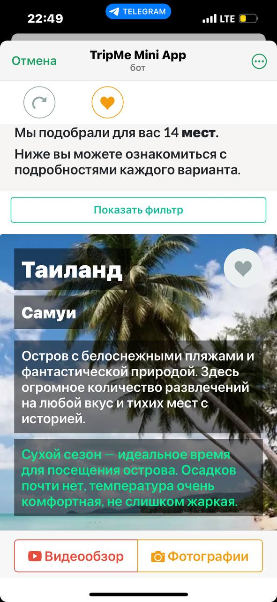
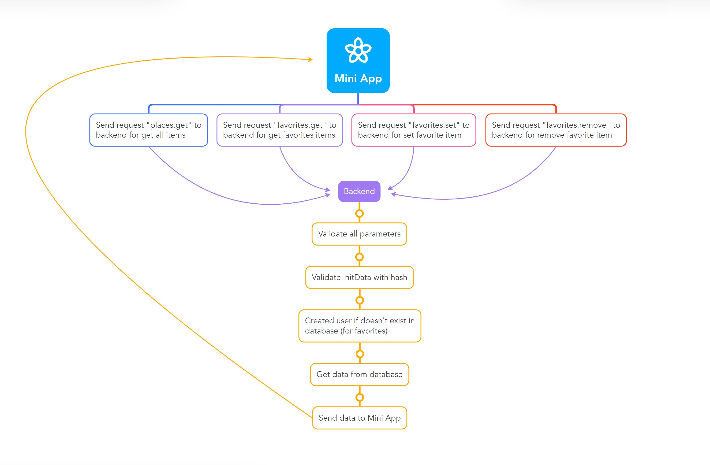

# TripMe Mini App for Telegram

## About
[TripMe Mini App](https://t.me/TripMeAppBot/miniapp) - a Mini App for independent travelers that shows places with the best season to travel in Asia. Answer 3 questions, and generate your personalized list of places to travel in the right month of your planned trip.

------------

## Full description
Trip Me App is the ideal app for independent travelers that reveals places with the best season to travel in Asia.
First, answer three questions to generate your personalized list of travel destinations. It will be based on your preferences and the best season for the month of your planned trip.
Next, explore each place with concise information, photos, and videos.
Lastly, add your chosen destinations to your favorites, where you can revisit and compare options, delving into the places in more detail.
TripMeApp helps travelers plan their trips efficiently and save time!

------------

## Screenshots

------------

## Prod version
https://t.me/TripMeAppBot/miniapp

------------

## Technical advantages
- Frontend is written without using JS frontend frameworks (React, Vue.JS, etc.), which is why it has a very simple and clear codebase and code architecture.
- Frontend use Telegram JavaScript library [“telegram-web-app.js”](https://telegram.org/js/telegram-web-app.js).
- Backend is implemented on the most popular server stack: Node.js and MySQL.
- Backend uses the most popular libraries: [Express](https://github.com/expressjs/express), [MySQL 2](https://github.com/sidorares/node-mysql2), [joi](https://github.com/hapijs/joi).

------------

## Features
- [x] good UX & UI with responsive layout
- [x] stored user entity in the database on the server side
- [x] implemented saving data for the user in the database on the server side (feature "add to favorites")
- [x] validation of all input parameters from the frontend on the server side
- [x] validation of initData data with hash from the frontend on the server side
- [x] view image gallery
- [x] using Telegram.WebApp.ready
- [x] using Telegram.WebApp.expand
- [x] using Telegram.WebApp.enableClosingConfirmation
- [x] using Telegram.WebApp.initData
- [x] using Telegram.WebApp.HapticFeedback
- [x] using Telegram.WebApp.showAlert
- [x] using Telegram.WebApp.showConfirm

------------

## Architecture
1. Mini App -> send request "places.get" to backend for get all items
2. Backend -> validate all parameters
3. Backend -> validate initData with hash
4. Backend -> created user if doesn't exist in database (for favorites)
5. Backend -> get data from database
6. Backend -> send data to Mini App
7. Mini App -> send request "favorites.get" to backend for get favorites items, and next points are similar: 2, 3, 5, 6
8. Mini App -> send request "favorites.set" to backend for set favorite item, and next points are similar: 2, 3, 5, 6
9. Mini App -> send request "favorites.remove" to backend for remove favorite item, and next points are similar: 2, 3, 5, 6

------------

## Architecture scheme

------------

## Repository content
- backend: all backend code
- frontend: all frontend code
- docs: compiled version of frontend (available via GitHub Pages)
- db-dump.sql: database dump for MySQL or MariaDB

------------

## How to install, run, build
To do this, please look at the README.md inside the backend and frontend

------------

## Issues
When you find issues, please report them!

------------

## Contributions
Patches are welcome! If you would like to contribute, but don't know what to work on, check the issues list.

------------

## Donations
If you'd like to buy me a beer, I won't complain. I will thank you! =)
- TON: [EQC0ibE0bHkj2rz3vaLiupwfCEPjasbO8WqgKslydt0NolXj](EQC0ibE0bHkj2rz3vaLiupwfCEPjasbO8WqgKslydt0NolXj)
- USDT TRC20: [TKvFWyRvCc6gifsHQDZuVHiyDdf2fa6Au8](TKvFWyRvCc6gifsHQDZuVHiyDdf2fa6Au8)

------------

## Contacts
Telegram: [@tgdev42](https://t.me/tgdev42)

------------

## License
MIT
